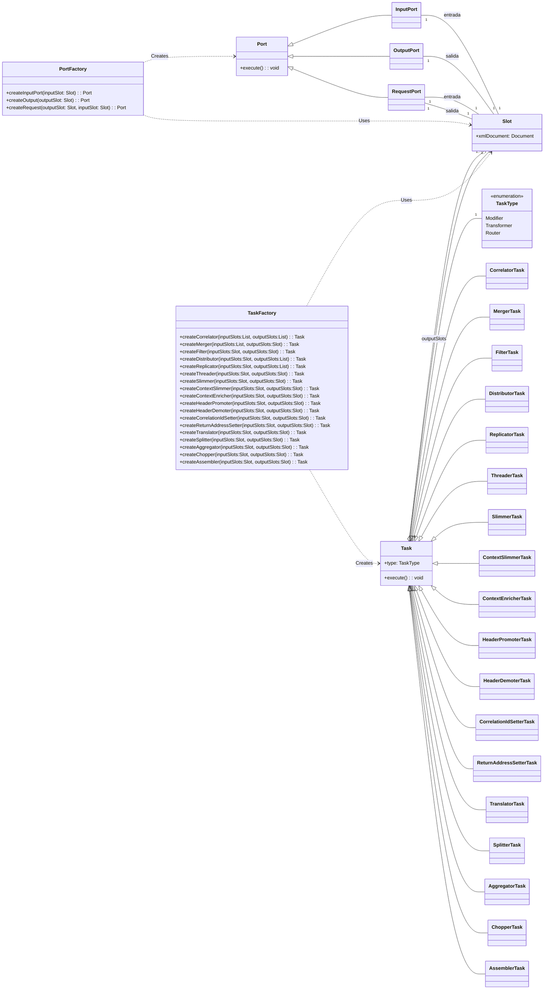

- [Doc Analisis](ANALISIS_Y_TESTS.md)

## Diagrama de clases


---

## 📚 Documentación de Tareas Implementadas

### 🔀 Merger (Router)

**Descripción**: Combina múltiples flujos de entrada en un único flujo de salida. A diferencia del Aggregator (que combina contenidos), el Merger simplemente fusiona/mezcla los mensajes de varios slots de entrada en uno de salida, preservando los documentos sin modificar su contenido.

**Tipo**: `TaskType.ROUTER`

**Características**:
- ✅ Múltiples input slots (N entradas)
- ✅ Un único output slot (1 salida)
- ✅ Preserva documentos originales sin modificación
- ✅ Procesa todos los documentos disponibles por llamada a `execute()`

#### Constructor

```java
/**
 * Constructor del Merger.
 * 
 * @param id Identificador único de la tarea
 * @param inputSlots Lista de slots de entrada a fusionar
 * @param outputSlot Slot de salida donde se escribirán todos los mensajes
 */
public Merger(String id, List<Slot> inputSlots, Slot outputSlot)
```

#### Casos de Uso

**Caso 1: Fusión básica de múltiples fuentes**
```java
// Tres fuentes de datos diferentes
Slot input1 = new Slot("input1");
Slot input2 = new Slot("input2");
Slot input3 = new Slot("input3");
Slot output = new Slot("merged");

// Cargar documentos en cada input
input1.setDocument(doc1);
input2.setDocument(doc2);
input3.setDocument(doc3);

// Crear merger y ejecutar
Merger merger = new Merger("basic-merger", 
    List.of(input1, input2, input3), 
    output);

merger.execute();

// El output contendrá los mensajes fusionados
```

**Caso 2: Pipeline con procesamiento paralelo convergente**
```java
// Dos ramas de procesamiento que convergen
Flow flow = new Flow("parallel-processing");

// Configurar slots
Slot source1 = new Slot("source1");
Slot source2 = new Slot("source2");
Slot branch1 = new Slot("branch1");
Slot branch2 = new Slot("branch2");
Slot merged = new Slot("merged");
Slot output = new Slot("output");

// Pipeline: 
// source1 -> filter1 -> branch1 --\
//                                   merger -> translator -> output
// source2 -> filter2 -> branch2 --/

flow.addTask(new Filter("filter1", source1, branch1, 
    "count(/order/items/item) >= 2"));
    
flow.addTask(new Filter("filter2", source2, branch2, 
    "count(/order/items/item) >= 1"));

flow.addTask(new Merger("merger", 
    List.of(branch1, branch2), 
    merged));

flow.addTask(new Translator("translator", merged, output, xslt));

flow.execute();
```

**Caso 3: Consolidación de múltiples fuentes de datos**
```java
// Escenario: Consolidar pedidos de múltiples regiones
Slot regionNA = new Slot("north-america");
Slot regionEU = new Slot("europe");
Slot regionASIA = new Slot("asia");
Slot consolidated = new Slot("all-orders");

// Conectores para cada región
InputPort naPort = new InputPort("na-input", 
    new FileConnector("na", "orders_na.xml"), regionNA);
InputPort euPort = new InputPort("eu-input", 
    new FileConnector("eu", "orders_eu.xml"), regionEU);
InputPort asiaPort = new InputPort("asia-input", 
    new FileConnector("asia", "orders_asia.xml"), regionASIA);

// Merger para consolidar todas las regiones
Merger regionalMerger = new Merger("regional-merger",
    List.of(regionNA, regionEU, regionASIA),
    consolidated);

// Flow completo
Flow globalFlow = new Flow("global-order-processing");
globalFlow.addPort(naPort);
globalFlow.addPort(euPort);
globalFlow.addPort(asiaPort);
globalFlow.addTask(regionalMerger);
// ... más tareas de procesamiento
globalFlow.execute();
```

**Caso 4: Merger con manejo de slots vacíos**
```java
// Algunos inputs pueden estar vacíos
Slot input1 = new Slot("input1");
Slot input2 = new Slot("input2"); // Vacío
Slot input3 = new Slot("input3");
Slot output = new Slot("output");

input1.setDocument(doc1);
// input2 no tiene documento
input3.setDocument(doc3);

Merger merger = new Merger("robust-merger", 
    List.of(input1, input2, input3), 
    output);

merger.execute();

// El merger procesa solo input1 e input3, 
// ignorando input2 que está vacío
```

#### Diagrama de Flujo

```
┌─────────────┐
│  Input 1    │──┐
│   [Doc A]   │  │
└─────────────┘  │
                 │
┌─────────────┐  │    ┌──────────┐    ┌─────────────┐
│  Input 2    │──┼───▶│  MERGER  │───▶│   Output    │
│   [Doc B]   │  │    └──────────┘    │ [A, B, C]*  │
└─────────────┘  │                    └─────────────┘
                 │
┌─────────────┐  │    * Nota: En la implementación actual,
│  Input 3    │──┘      Slot solo mantiene el último mensaje.
│   [Doc C]   │         Para múltiples mensajes, considerar
└─────────────┘         usar Queue en Slot.
```

#### Diferencias con Tareas Similares

| Tarea | Tipo | Entradas | Salidas | Operación |
|-------|------|----------|---------|-----------|
| **Filter** | Router | 1 slot | 1 slot | Pasa o bloquea según condición XPath |
| **Merger** | Router | **N slots** | 1 slot | **Fusiona mensajes** sin modificar |
| **Aggregator** | Transformer | N slots | 1 slot | **Combina contenidos** en 1 documento |
| **Splitter** | Transformer | 1 slot | N slots | Divide 1 documento en N |

---

### 🧹 ContextSlimmer (Modifier)

**Descripción**: Elimina información de contexto innecesaria de los documentos. Similar a Slimmer, pero diseñado específicamente para remover metadatos, información de enrutamiento, headers temporales, o datos de contexto que ya no son necesarios en etapas posteriores del pipeline. Puede eliminar múltiples nodos simultáneamente usando expresiones XPath.

**Tipo**: `TaskType.MODIFIER`

**Características**:
- ✅ Elimina múltiples nodos que coincidan con el XPath
- ✅ Preserva el documento original (crea copia)
- ✅ Útil para limpiar metadatos de routing/correlation
- ✅ Itera en reversa para evitar problemas de índice al eliminar

#### Constructor

```java
/**
 * Constructor del ContextSlimmer.
 * 
 * @param id Identificador único de la tarea
 * @param inputSlot Slot de entrada con el documento a procesar
 * @param outputSlot Slot de salida donde se escribirá el documento limpio
 * @param xpath Expresión XPath para identificar nodos de contexto a eliminar
 */
public ContextSlimmer(String id, Slot inputSlot, Slot outputSlot, String xpath)
```

#### Casos de Uso

**Caso 1: Eliminar metadata temporal de routing**
```java
// Documento con información de enrutamiento temporal
String xml = """
    <message>
        <header><id>MSG001</id></header>
        <routingContext>
            <correlationId>abc-123</correlationId>
            <returnAddress>queue://responses</returnAddress>
        </routingContext>
        <body><data>Important payload</data></body>
    </message>
    """;

Slot input = new Slot("input");
Slot output = new Slot("output");

input.setDocument(createXMLDocument(xml));

// Eliminar toda la sección de routing context
ContextSlimmer slimmer = new ContextSlimmer("routing-cleaner", 
    input, output, 
    "/message/routingContext");

slimmer.execute();

// El output tendrá header y body, pero sin routingContext
```

**Caso 2: Limpiar múltiples nodos metadata distribuidos**
```java
// Documento con múltiples nodos metadata en diferentes niveles
Slot input = new Slot("input");
Slot output = new Slot("output");

input.setDocument(orderDoc);

// Eliminar TODOS los nodos <metadata> sin importar dónde estén
ContextSlimmer slimmer = new ContextSlimmer("metadata-cleaner", 
    input, output, 
    "//metadata");

slimmer.execute();

// Todos los nodos <metadata> han sido eliminados
```

**Caso 3: Pipeline de limpieza antes de enviar a sistema externo**
```java
// Preparar documento para envío externo eliminando datos internos
Flow flow = new Flow("external-export");

Slot source = new Slot("source");
Slot cleaned = new Slot("cleaned");
Slot transformed = new Slot("transformed");
Slot output = new Slot("output");

// 1. Eliminar contexto interno
flow.addTask(new ContextSlimmer("internal-cleaner", 
    source, cleaned, 
    "//internalContext | //debugInfo | //processingMetadata"));

// 2. Transformar a formato externo
flow.addTask(new Translator("external-format", 
    cleaned, transformed, externalXslt));

// 3. Enviar
flow.addPort(new OutputPort("external-api", 
    new HttpConnector("api", "https://external.api/endpoint"), 
    transformed));

flow.execute();
```

**Caso 4: Eliminar información sensible antes de logging**
```java
// Limpiar datos sensibles antes de registrar para auditoría
Slot input = new Slot("input");
Slot sanitized = new Slot("sanitized");

input.setDocument(customerDoc);

// Eliminar información sensible: password, creditCard, ssn, etc.
ContextSlimmer sanitizer = new ContextSlimmer("pii-sanitizer", 
    input, sanitized, 
    "//password | //creditCard | //ssn | //bankAccount");

sanitizer.execute();

// El documento sanitizado puede ser logueado de forma segura
```

#### Diferencias con Slimmer

| Aspecto | Slimmer | ContextSlimmer |
|---------|---------|----------------|
| **Propósito** | Eliminar nodos específicos | Eliminar contexto/metadata |
| **Alcance** | Típicamente un nodo | Múltiples nodos simultáneos |
| **Uso típico** | Simplificar estructura | Limpiar metadata de pipeline |
| **Ejemplo** | Eliminar sección "header" | Eliminar todos los "//metadata" |

---

### ✂️ Chopper (Transformer)

**Descripción**: Divide documentos grandes en fragmentos más pequeños. Utiliza XPath para identificar elementos que deben ser extraídos como fragmentos independientes. Cada fragmento se empaqueta en un nuevo documento con un wrapper y metadatos de fragmentación, permitiendo su posterior reensamblaje con Assembler.

**Tipo**: `TaskType.TRANSFORMER`

**Características**:
- ✅ Extrae elementos individuales de colecciones
- ✅ Añade metadatos de fragmentación (índice, total, ID original)
- ✅ Wrapper configurable para cada fragmento
- ✅ Preserva trazabilidad con IDs únicos por fragmento
- ✅ Facilita procesamiento paralelo de documentos grandes

#### Constructores

```java
/**
 * Constructor completo del Chopper.
 * 
 * @param id Identificador único de la tarea
 * @param inputSlot Slot de entrada con el documento a fragmentar
 * @param outputSlot Slot de salida donde se escribirán los fragmentos
 * @param xpath Expresión XPath para identificar elementos a extraer
 * @param wrapperElementName Nombre del elemento raíz para cada fragmento
 */
public Chopper(String id, Slot inputSlot, Slot outputSlot, 
               String xpath, String wrapperElementName)

/**
 * Constructor simplificado (usa "fragment" como wrapper).
 */
public Chopper(String id, Slot inputSlot, Slot outputSlot, String xpath)
```

#### Casos de Uso

**Caso 1: Dividir pedido con múltiples items**
```java
// Documento con orden que contiene múltiples items
String xml = """
    <order>
        <header><orderId>12345</orderId></header>
        <items>
            <item><productId>P001</productId><quantity>2</quantity></item>
            <item><productId>P002</productId><quantity>1</quantity></item>
            <item><productId>P003</productId><quantity>5</quantity></item>
        </items>
    </order>
    """;

Slot input = new Slot("input");
Slot output = new Slot("output");

input.setDocument(createXMLDocument(xml));

// Extraer cada item como fragmento independiente
Chopper chopper = new Chopper("item-chopper", 
    input, output, 
    "/order/items/item",
    "itemFragment");

chopper.execute();

// Genera 3 fragmentos, cada uno con estructura:
// <itemFragment>
//   <choppedMetadata fragmentIndex="0" totalFragments="3" originalMessageId="..."/>
//   <item>...</item>
// </itemFragment>
```

**Caso 2: Procesamiento paralelo de catálogo de productos**
```java
// Dividir catálogo grande para procesamiento distribuido
Slot catalogInput = new Slot("catalog");
Slot fragments = new Slot("fragments");

catalogInput.setDocument(largeCatalog);

// Extraer cada producto como fragmento
Chopper chopper = new Chopper("catalog-chopper", 
    catalogInput, fragments, 
    "//product",
    "productMessage");

chopper.execute();

// Cada fragmento puede ser procesado en paralelo por workers diferentes
```

**Caso 3: Pipeline Chopper -> Procesar -> Assembler**
```java
// Pipeline completo: dividir, procesar fragmentos, reensamblar
Flow flow = new Flow("divide-process-conquer");

Slot source = new Slot("source");
Slot fragments = new Slot("fragments");
Slot processed = new Slot("processed");
Slot assembled = new Slot("assembled");

// 1. Dividir documento bulk en fragmentos
flow.addTask(new Chopper("chopper", 
    source, fragments, 
    "//record",
    "recordFragment"));

// 2. Procesar cada fragmento (enriquecer, validar, transformar)
flow.addTask(new ContextEnricher("enricher", 
    fragments, processed));

// 3. Reensamblar fragmentos procesados
flow.addTask(new Assembler("assembler", 
    processed, assembled, 
    "processedRecords"));

flow.execute();
```

**Caso 4: Dividir por tipo con wrapper personalizado**
```java
// Extraer transacciones de diferentes tipos
Slot input = new Slot("input");
Slot output = new Slot("output");

input.setDocument(transactionsDoc);

// Extraer solo transacciones de tipo "payment"
Chopper paymentChopper = new Chopper("payment-chopper", 
    input, output, 
    "//transaction[@type='payment']",
    "paymentMessage");

paymentChopper.execute();
```

#### Estructura de Fragmentos Generados

```xml
<fragment>
  <choppedMetadata 
    fragmentIndex="0" 
    totalFragments="3" 
    originalMessageId="msg-abc123"/>
  
  <!-- Contenido extraído del documento original -->
  <item>
    <productId>P001</productId>
    <name>Widget</name>
  </item>
</fragment>
```

---

### 🔧 Assembler (Transformer)

**Descripción**: Ensambla fragmentos generados por Chopper en un documento completo. Es la operación inversa de Chopper. Utiliza los metadatos de fragmentación para reconstruir correctamente el documento, ordenando fragmentos por índice y agrupándolos por ID de mensaje original.

**Tipo**: `TaskType.TRANSFORMER`

**Características**:
- ✅ Agrupa fragmentos por `originalMessageId`
- ✅ Ordena fragmentos por `fragmentIndex`
- ✅ Espera hasta recibir todos los fragmentos antes de ensamblar
- ✅ Buffer interno para acumular fragmentos incompletos
- ✅ Extrae contenido de wrappers automáticamente

#### Constructores

```java
/**
 * Constructor completo del Assembler.
 * 
 * @param id Identificador único de la tarea
 * @param inputSlot Slot de entrada con fragmentos
 * @param outputSlot Slot de salida donde se escribirá el documento ensamblado
 * @param rootElementName Nombre del elemento raíz del documento ensamblado
 * @param contentXPath XPath para extraer contenido (opcional)
 */
public Assembler(String id, Slot inputSlot, Slot outputSlot, 
                 String rootElementName, String contentXPath)

/**
 * Constructor simplificado (extrae primer hijo del wrapper).
 */
public Assembler(String id, Slot inputSlot, Slot outputSlot, 
                 String rootElementName)
```

#### Casos de Uso

**Caso 1: Reensamblar items procesados**
```java
// Recibir fragmentos (típicamente de una cola o múltiples ejecuciones)
Slot fragmentInput = new Slot("fragments");
Slot assembled = new Slot("assembled");

Assembler assembler = new Assembler("item-assembler", 
    fragmentInput, assembled, 
    "reconstructedOrder");

// Procesar fragmentos a medida que llegan
for (Document fragment : incomingFragments) {
    fragmentInput.setDocument(fragment);
    assembler.execute();
}

// Cuando todos los fragmentos han sido procesados,
// el documento completo estará en 'assembled'
```

**Caso 2: Pipeline Chopper -> Enriquecer -> Assembler**
```java
// Pipeline completo de procesamiento por fragmentos
Flow flow = new Flow("fragment-processing");

Slot source = new Slot("source");
Slot chopped = new Slot("chopped");
Slot enriched = new Slot("enriched");
Slot final = new Slot("final");

// 1. Dividir documento grande
flow.addTask(new Chopper("chopper", 
    source, chopped, 
    "//customer",
    "customerFragment"));

// 2. Enriquecer cada fragmento con datos externos
flow.addTask(new ContextEnricher("enricher", 
    chopped, enriched));

// 3. Reensamblar clientes enriquecidos
flow.addTask(new Assembler("assembler", 
    enriched, final, 
    "enrichedCustomers"));

flow.execute();
```

**Caso 3: Procesamiento distribuido con reensamblaje**
```java
// Escenario: Workers procesan fragmentos en paralelo,
// luego se reensamblan centralmente
Slot assemblyQueue = new Slot("assembly-queue");
Slot completed = new Slot("completed");

Assembler assembler = new Assembler("distributed-assembler", 
    assemblyQueue, completed, 
    "results");

// Simular recepción de fragmentos de diferentes workers
// Worker 1 completó fragmento 0
assemblyQueue.setMessage(fragmentFromWorker1);
assembler.execute();

// Worker 3 completó fragmento 2 (fuera de orden)
assemblyQueue.setMessage(fragmentFromWorker3);
assembler.execute();

// Worker 2 completó fragmento 1 (último fragmento)
assemblyQueue.setMessage(fragmentFromWorker2);
assembler.execute();

// ¡Documento completo generado en orden correcto!
Document result = completed.getDocument();
```

**Caso 4: Reensamblar con validación**
```java
// Reensamblar solo si todos los fragmentos pasan validación
Slot fragments = new Slot("fragments");
Slot validated = new Slot("validated");
Slot assembled = new Slot("assembled");

Flow flow = new Flow("validated-assembly");

// 1. Validar cada fragmento
flow.addTask(new ValidatorTask("validator", 
    fragments, validated));

// 2. Reensamblar solo fragmentos válidos
flow.addTask(new Assembler("safe-assembler", 
    validated, assembled, 
    "validatedData"));

flow.execute();
```

#### Comportamiento del Buffer Interno

```java
// El Assembler mantiene un buffer interno de fragmentos
// hasta que recibe todos los fragmentos de un mensaje

fragmentBuffer = {
  "msg-123": [
    FragmentInfo(index=0, content=<item>A</item>),
    FragmentInfo(index=2, content=<item>C</item>)
    // Falta index=1, no ensambla todavía
  ],
  "msg-456": [
    FragmentInfo(index=0, content=<data>X</data>),
    FragmentInfo(index=1, content=<data>Y</data>),
    FragmentInfo(index=2, content=<data>Z</data>)
    // Completo! Ensambla y limpia buffer
  ]
}
```

#### Documento Ensamblado Resultante

**Input** (3 fragmentos):
```xml
<!-- Fragmento 0 -->
<fragment>
  <choppedMetadata fragmentIndex="0" totalFragments="3" originalMessageId="msg-123"/>
  <item><name>Alpha</name></item>
</fragment>

<!-- Fragmento 1 -->
<fragment>
  <choppedMetadata fragmentIndex="1" totalFragments="3" originalMessageId="msg-123"/>
  <item><name>Beta</name></item>
</fragment>

<!-- Fragmento 2 -->
<fragment>
  <choppedMetadata fragmentIndex="2" totalFragments="3" originalMessageId="msg-123"/>
  <item><name>Gamma</name></item>
</fragment>
```

**Output** (ensamblado):
```xml
<assembledItems>
  <item><name>Alpha</name></item>
  <item><name>Beta</name></item>
  <item><name>Gamma</name></item>
</assembledItems>
```

#### Relación Chopper ↔ Assembler

| Operación | Chopper | Assembler |
|-----------|---------|-----------|
| **Input** | 1 documento grande | N fragmentos |
| **Output** | N fragmentos | 1 documento completo |
| **Metadatos** | Añade metadata | Consume metadata |
| **Orden** | Genera índices | Reordena por índices |
| **Buffer** | No mantiene estado | Buffer interno para fragmentos |
| **Uso típico** | Dividir para procesamiento paralelo | Reensamblar resultados |

---
