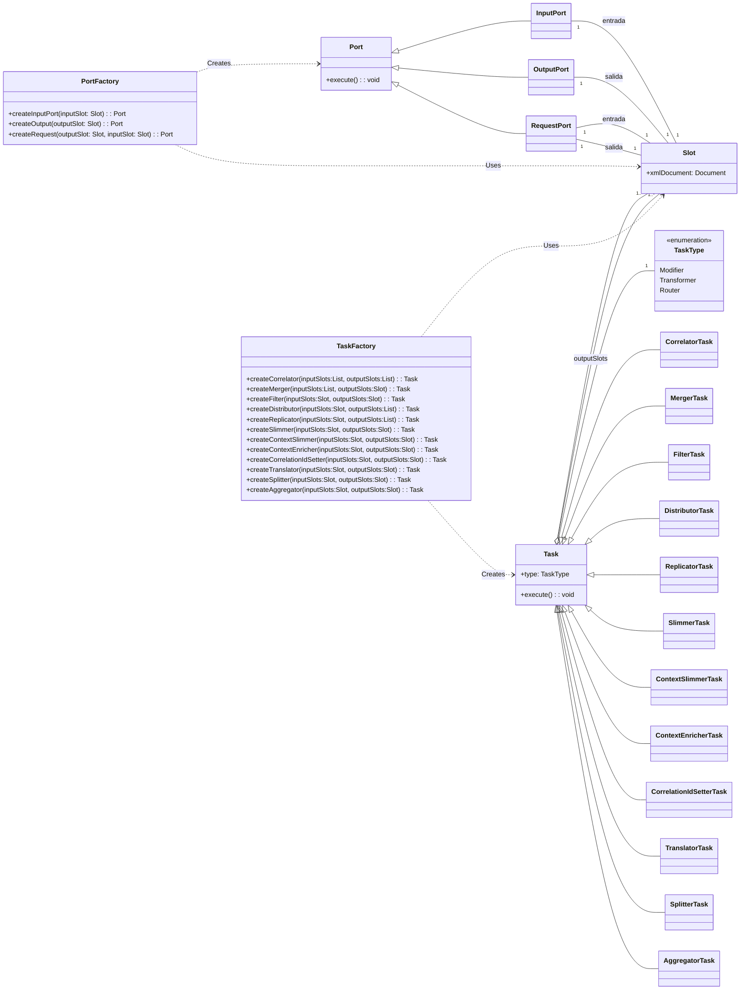

# DSL Framework Documentation

Documentación del framework DSL para la construcción de flujos de integración.

- [Doc Analisis](ANALISIS_Y_TESTS.md)

## Diagrama de Clases



---

## 🧩 Conceptos Core

El framework se basa en una arquitectura de "Pipes and Filters" donde los mensajes fluyen a través de tareas de procesamiento.

### Flow

Es el motor de ejecución. Orquesta la ejecución de todas las tareas y conectores. Puede configurarse para ejecución secuencial o concurrente.

### Slot

Es el contenedor de datos que conecta las tareas. Actúa como un "buffer" o "tubería" entre componentes.

- **Entrada/Salida**: Las tareas leen de slots de entrada y escriben en slots de salida.
- **Documento**: Cada slot almacena un documento XML (`org.w3c.dom.Document`).

### Port

Puntos de entrada y salida del sistema hacia el mundo exterior (sistemas externos, archivos, bases de datos).

- **InputPort**: Recibe datos externos y los coloca en un Slot.
- **OutputPort**: Toma datos de un Slot y los envía al exterior.
- **RequestPort**: Combinación de Input/Output para operaciones síncronas (ej. petición HTTP o consulta DB que devuelve resultados).

---

## 📦 Componentes del Framework

### Connectors

Encargados de la comunicación física con recursos externos.

| Conector | Descripción |
|----------|-------------|
| **FileConnector** | Lee y escribe archivos en el sistema local. |
| **HttpConnector** | Realiza peticiones HTTP (GET, POST). Útil para integrar APIs REST. |
| **DataBaseConnector** | Ejecuta consultas SQL (JDBC). Transforma resultados a XML. |
| **ConsoleConnector** | Lee de STDIN y escribe en STDOUT. |
| **MockConnector** | Simula un sistema externo para pruebas. |

### Tasks

Unidades lógicas de procesamiento.

#### 🔀 Routers (Enrutadores)

Deciden el camino que sigue el mensaje.

- **Distributor**: Envía el mensaje a UNO de varios slots de salida basándose en condiciones XPath. (Switch/Case).
- **Replicator**: Copia el mensaje idéntico a TODOS los slots de salida. (Multicast).
- **Filter**: Permite el paso del mensaje solo si cumple una condición XPath. (If).
- **Merger**: Combina múltiples flujos de entrada en uno solo. No fusiona contenido, solo canaliza mensajes.
- **Correlator**: Sincroniza y agrupa mensajes relacionados que llegan por diferentes caminos (espera a tener todos los mensajes de un grupo antes de continuar).

#### 🛠️ Modifiers (Modificadores)

Alteran el contenido o metadatos del mensaje.

- **ContextEnricher**: Toma un mensaje principal y lo "enriquece" con datos provenientes de otro slot (ej. resultado de una consulta DB).
- **ContextSlimmer**: Elimina partes específicas del documento (limpieza de contexto).
- **Slimmer**: Versión simplificada para eliminar nodos.
- **CorrelationIdSetter**: Asigna un ID de correlación único al mensaje para trazabilidad.

#### 🔄 Transformers (Transformadores)

Transforman la estructura del mensaje.

- **Translator**: Aplica transformaciones XSLT para convertir el XML de un formato a otro.
- **Splitter**: Divide un documento grande (ej. una lista) en múltiples mensajes individuales.
- **Aggregator**: Combina múltiples mensajes individuales en un solo documento (operación inversa al Splitter).

---

## ☕ Ejemplo de Implementación: Café (Main.java)

El archivo `Main.java` contiene un ejemplo completo ("Cafe Implementation") que simula el procesamiento de órdenes de una cafetería.

### Escenario

1. Llega un archivo con una orden que contiene lista de bebidas (`input.xml`).
2. Las bebidas pueden ser "frías" (cold) o "calientes" (hot).
3. **Bebidas Frías**: Se verifica su estado en una Base de Datos.
4. **Bebidas Calientes**: Se solicita su preparación a un servicio HTTP externo.
5. Al final, se consolida todo en una única orden procesada (`output.xml`).

### Flujo Paso a Paso

#### 1. Entrada (`FileConnector` -> `InputPort`)

- Se lee `input.xml`.
- **Datos**: Lista de `<drink>`.

#### 2. División (`Splitter`)

- Separa la orden completa en mensajes individuales por cada bebida.
- **XPath**: `/cafe_order/drinks/drink`

#### 3. Identificación (`CorrelationIdSetter`)

- Asigna un ID único a cada bebida para poder rastrearla luego.

#### 4. Distribución (`Distributor`)

- Separa las bebidas según su tipo.
- **Ruta 1 (Cold)**: `/drink/type='cold'`
- **Ruta 2 (Hot)**: `/drink/type='hot'`

#### 5. Procesamiento Paralelo

**Rama Frías (Base de Datos):**

1. **Replicator**: Copia el mensaje para mantener el original y usar otra copia para la consulta.
2. **Translator**: Transforma el XML de la bebida en una consulta SQL (`SELECT * FROM drinks...`).
3. **RequestPort (DB)**: Ejecuta la SQL en H2 Database.
4. **Correlator**: Espera a tener la bebida original Y el resultado de la DB.
5. **ContextEnricher**: Combina la info original con el estado obtenido de la DB.

**Rama Calientes (HTTP):**

1. **Replicator**: Copia el mensaje.
2. **Translator**: Transforma el XML (drink) en una petición HTTP XML (`<http-request>`).
3. **RequestPort (HTTP)**: Envía POST/GET a `https://httpbin.org`.
4. **Correlator**: Sincroniza la bebida original con la respuesta HTTP.
5. **ContextEnricher**: Añade la respuesta del servidor al mensaje original.

#### 6. Fusión (`Merger`)

- Recibe los mensajes procesados de ambas ramas (frías y calientes) y los pone en un solo canal.

#### 7. Agregación (`Aggregator`)

- Junta todas las bebidas procesadas individuales de nuevo en una sola lista/documento.

#### 8. Salida (`OutputPort` -> `FileConnector`)

- Escribe el resultado final en `output.xml`.

### Código Clave

```java
// Definición del Router (Distributor) para separar Frías vs Calientes
var distributor = routerFactory.createDistributorTask("distributor",
    outputSlotCorrelationIdSetter,
    List.of(outputSlotDistributorToFrias, outputSlotDistributorToCalientes),
    List.of("/drink/type='cold'", "/drink/type='hot'"));

// Conexión a Base de Datos (Rama Fría)
var dbConnectorFrias = new DataBaseConnector(requestPortFrias,
    "jdbc:h2:mem:testdb;DB_CLOSE_DELAY=-1", null, null);

// Conexión HTTP (Rama Caliente)
var httpConnectorCalientes = new HttpConnector(requestPortCalientes);
```
